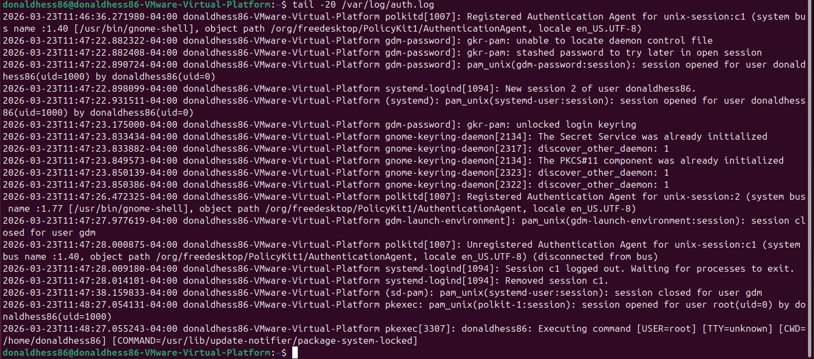
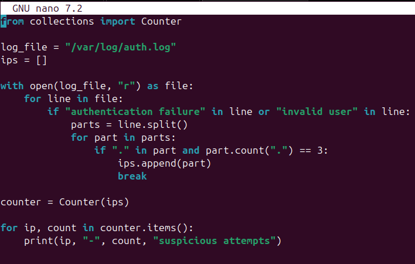

# Mini SOC Log Analysis Lab

## Overview
This project simulates a small SOC-style workflow using Linux and Python to analyze authentication logs and identify suspicious SSH activity.

## Objective
Analyze `/var/log/auth.log` to detect repeated authentication failures and extract suspicious IP addresses.

## Tools Used
- Ubuntu Linux
- Python 3
- /var/log/auth.log

## Skills Demonstrated
- Log Analysis
- Threat Detection
- Python Scripting
- Linux Command Line

## Project Workflow
1. Reviewed authentication logs using:
   ```
   tail -20 /var/log/auth.log
   ```
2. Identified suspicious patterns such as:
   - authentication failures
   - invalid user attempts
3. Built a Python script to:
   - parse logs
   - extract IP addresses
   - count suspicious attempts
4. Displayed results in the terminal

## Python Script
```python
from collections import Counter

log_file = "/var/log/auth.log"
ips = []

with open(log_file, "r") as file:
    for line in file:
        if "authentication failure" in line or "invalid user" in line:
            parts = line.split()
            for part in parts:
                if "." in part and part.count(".") == 3:
                    ips.append(part)
                    break

counter = Counter(ips)

for ip, count in counter.items():
    print(ip, "-", count, "suspicious attempts")
```

## Screenshots

### Viewing Logs


### Python Script


### Script Output

This output highlights IP addresses associated with repeated suspicious authentication attempts identified within system logs.
## Example Output
```
127.0.0.1 - 14 suspicious attempts
```

## Summary
This project demonstrates basic SOC-level log analysis by identifying suspicious authentication behavior and extracting relevant indicators such as IP addresses.

## Author
Donald Hess
